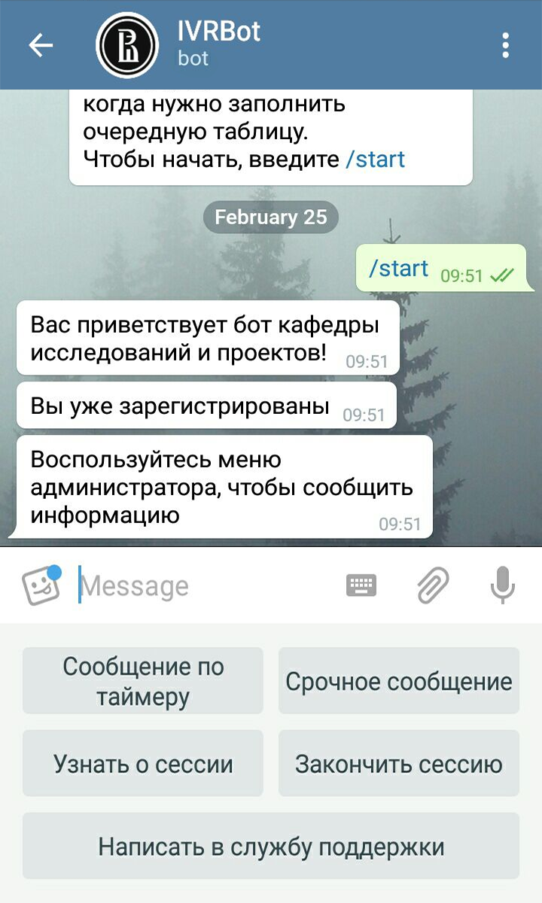

# Telegram-Бот @IVRBot #
- - -
###### Telegram-клиент Кафедры Исследовательской и Проектной деятельности учащихся Лицея ВШЭ ######
###### Москва, 2018

## О боте 
Telegram-бот был создан в 2017-2018 учебном году в рамках проектной деятельности учащихся Лицея ВШЭ. 

Цель написания Telegram-бота - создание удобного инструмента коммуникации между администрацией Кафедры и учащимися.

Бот реализован на языке Python с помощью библиотек PyTelegramBotAPI и SQLite и использует базы данных для обработки информации о зарегестрированных пользователях.

Основной код Telegram-бота доступен в файле bot_main.py. Обширное количество комментариев дает возможность использовать код в качестве учебного для тех, кто только начинает разрабатывать Telegram-ботов.

## Шаг 1. Регистрация (или вход)

Начало работы классическое - в описании сказана пара слов о том, зачем этот бот нужен, а сам он вызывается по функции /start . 

После вызова бота ID сообщения - то есть ID пользователя - анализируется ботом. Он сравнивает ID со всеми, существующими в базе данных, и уже из этого делает вывод, нужна регистрация или нет. 

Если ID оказывается новым, то пользователь переходит к процедуре регистрации. Если ID уже есть в базе данных, то в зависимости от прошлой регистрации пользователь переходит либо в меню администратора, либо в меню ученика.

Бот не нашел ID в базе данных         | Бот нашел ID в базе
--------------------------------------|----------------------
  |

Для того, чтобы зарегестрироваться, пользователю нужно придумать логин. 

Логин вводится самим пользователем в виде строки. Бот проверяет логин на уникальность (пробегая циклом по таблице) и заносит ID и логин в базу данных.

Следующая развилка - статус пользователя. Если пользователь - ученик, то необходимо провести регистрацию его параметров и отправить в личный кабинет ученика. Если пользователь - администратор, то необходимо проверить пароль и направить пользователя в кабинет администратора.

Ученик может выбрать любой предмет и любой класс. В зависимости от этого ему будут отправляться те уведомления, которые нужны именно ему. Темы и класс выбираются из предлагающихся клавиатур (образованных методом ReplyKeyboardMarkup):

Сначала пользователь выбирает предмет,        | затем - класс
--------------------------------------|----------------------
  | 

На этом процесс регистрации пользователя заканчивается. Пользователь переходит в меню.

## Шаг 2. Меню (ученика и администратора)
Меню ученика и администратора выглядят следующим образом: 

Меню ученика | Меню администратора
--------------------|----------------------
|

### Меню ученика
В меню ученика с помощью метода ReplyKeyboardMarkup реализованы следующие возможности:
- Получение информации о типах уведомлений

    > Через обращение к базе данных по ID
- Возможность изменить тип уведомлений

    > Через изменение параметров ячейки базы данных, соответствующей ID
- Контакты тех поддержки

- Выход из меню 
    > При этом фоновые сообщения остаются активными,
    > то есть пользователь получит срочное сообщение от администратора
    > и не пропустит дедлайн

#### Получение информации о типах уведомлений
  
 
#### Изменение уведомлений
  
 
Изменение уведомлений происходит через уже использовавшиеся при регистрации слоты ReplyKeyboardMarkup. Информация, переданная ими, записывается в базу данных в ячейки, подходящие под ID ученика.
 
#### Контакты службы поддержки поддержки
 

#### Выход из меню
 

### Меню администратора
Меню администратора релазиовано тем же методом, что и меню ученика. У администратора есть следующие функции:
- Узнать о типах уведомлений

   > То же, что есть и у ученика
- Контакты службы поддержки

   > Общая функция для обоих меню
- Закончить сессию

   > Также общая функция
- Отправить срочное сообщение

   > Уникальная возможность администратора, дает возможность отправлять сообщение необходимым группам учеников
- Создание сообщения по таймеру

   > Пока что находится в разработке
 
